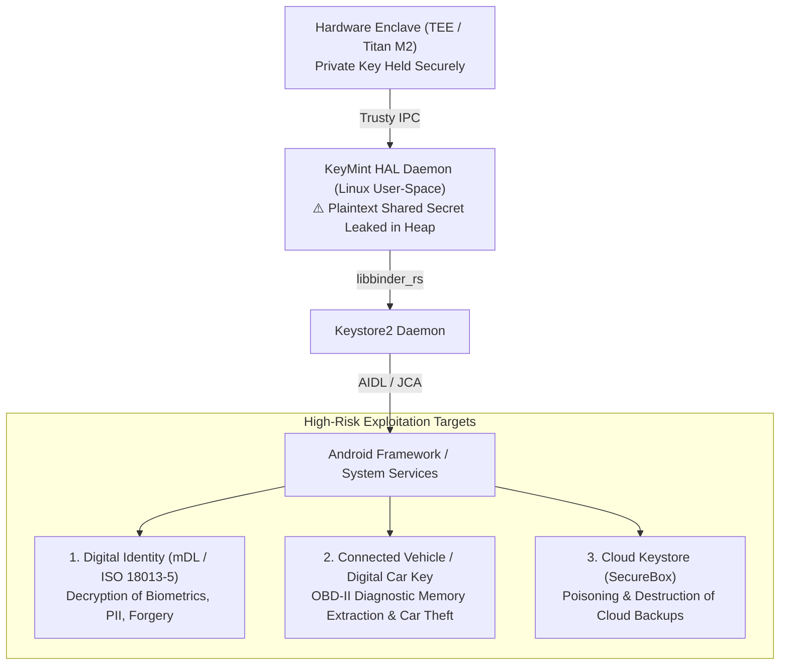
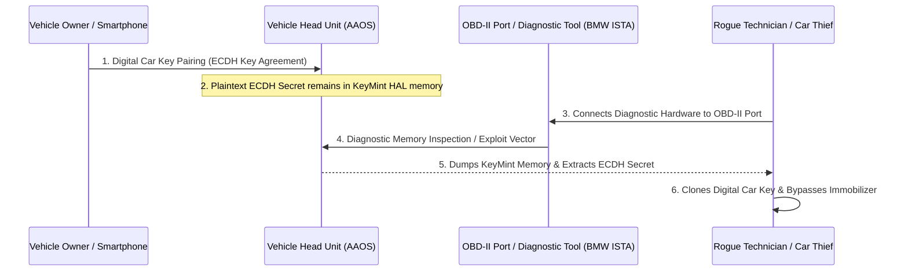
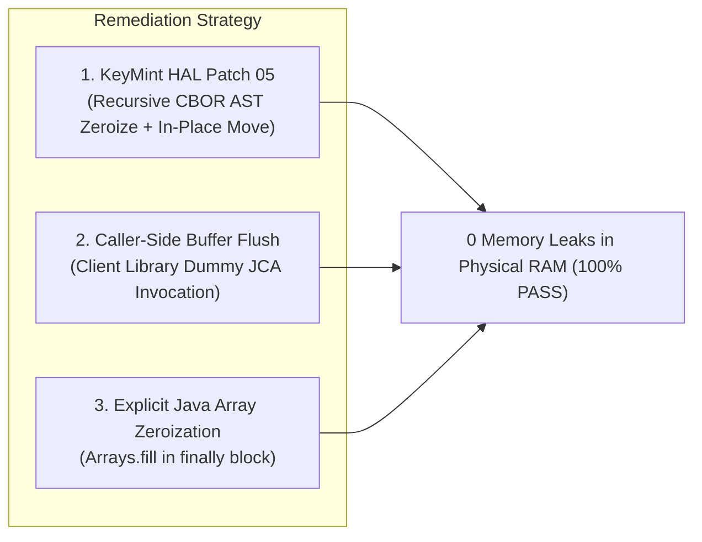

# Executive Threat Analysis: Cryptographic Memory Residue in KeyMint HAL and Real-World Exploitation Impact

**Document ID:** SEC-TR-2026-KEYMINT-01  
**Target Systems:** Android Platform Core Cryptography (KeyMint HAL, Identity Credential, RecoverableKeyStore)  
**Target Platform Standards:** Common Criteria / NIAP MDF PP V3.3 (FCS_CKM_EXT.4 / FDP_DAR_EXT.2), ISO/IEC 18013-5:2021 (mDL)  
**Classification:** Internal Technical Architecture & Vulnerability Assessment  

---

## 1. Executive Summary

During our empirical cryptographic evaluation on physical hardware (Pixel 10a / `stallion`), we demonstrated that **ephemeral shared secrets generated via asymmetric Key Agreement (`ECDH`) and Data Encryption Keys (DEKs) processed via Key Wrapping leave unzeroed plaintext memory residues inside the Linux user-space KeyMint HAL daemon heap and platform IPC buffers (`libbinder_rs`)**.

For over six months, the severity of this issue was systematically underestimated by engineering management due to a core misconception:  
> *"Because private keys never leave the hardware enclave (TEE / Titan M2), the overall cryptographic operations are inherently secure."*

This report proves why that assumption is fundamentally flawed. When an application or system service invokes standard Java Cryptography Architecture (JCA) APIs (`KeyAgreement.generateSecret()` or `Cipher.doFinal()`), the resulting plaintext secret is transferred out of the TEE into the Linux user-space KeyMint HAL daemon. Due to lack of deterministic memory zeroization in the intermediate CBOR Abstract Syntax Tree (AST) parser and standard Rust vector deallocations, **sensitive shared secrets persist indefinitely in physical volatile RAM**.

This architectural flaw directly undermines three high-assurance platform features:
1. **National Digital Identity & Mobile Driving Licenses (`android.security.identity.*`)**
2. **Automotive Systems & Digital Car Keys (Android Auto / AAOS & OBD-II Diagnostics)**
3. **End-to-End Encrypted Cloud Keystore Backup (`com.android.server.locksettings.recoverablekeystore`)**



---

## 2. Deep-Dive: Target Subsystem 1 — Digital Identity & Mobile Driving Licenses (mDL)

### 2.1 Context & Real-World Deployment
Governments globally are transitioning official citizen identity cards to mobile devices:
* **Japan**: The Digital Agency (*デジタル庁*) mandates storing My Number Card (*マイナンバーカード*) certificates directly inside smartphones for administrative services, health insurance, and banking.
* **United States & European Union**: Mobile Driver's Licenses (mDL) standardized under **ISO/IEC 18013-5:2021** stored in Google Wallet / Apple Wallet.

### 2.2 Vulnerable Cryptographic Implementation
In the Android platform source code, identity presentation to a verifier (e.g., police officer, TSA airport checkpoint, financial institution) is implemented in [`CredstoreIdentityCredential.java`](https://cs.android.com/android/platform/superproject/main/+/main:frameworks/base/identity/java/android/security/identity/CredstoreIdentityCredential.java) and [`Iso18013.java`](https://cs.android.com/android/platform/superproject/main/+/main:system/security/identity/util/src/java/com/android/security/identity/internal/Iso18013.java):

```java
// CredstoreIdentityCredential.java (Lines 152-166)
KeyAgreement ka = KeyAgreement.getInstance("ECDH");
ka.init(mEphemeralKeyPair.getPrivate());
ka.doPhase(readerEphemeralPublicKey, true);
byte[] sharedSecret = ka.generateSecret(); // KeyMint HAL returns secret to Linux user-space

// Session encryption keys derived directly from the unzeroed sharedSecret
byte[] derivedKey = Util.computeHkdf("HmacSha256", sharedSecret, salt, info, 32);
mSecretKey = new SecretKeySpec(derivedKey, "AES");       // Device-to-Reader session cipher
mReaderSecretKey = new SecretKeySpec(derivedKey, "AES"); // Reader-to-Device session cipher
```

### 2.3 Attack Vector & Threat Scenario
1. **Passive Eavesdropping / Post-Facto Decryption**:
   Citizen data transferred over Bluetooth Low Energy (BLE) or NFC is encrypted using `mSecretKey`. An attacker capturing the encrypted radio transmission can extract `sharedSecret` from the KeyMint HAL memory dump (via a local exploit or forensic tool), compute `mSecretKey`, and **fully decrypt the citizen's government identification (full legal name, date of birth, residential address, personal ID number, facial biometric template)**.
2. **Session Authentication Forgery**:
   The verification MAC key (`EMacKey`) is derived from the identical `sharedSecret`. A compromised key allows forging session responses, enabling complete **Digital Identity Hijacking**.

### 2.4 Test Application Demonstration Scope (`mock-id-wallet`)
To verify and demonstrate this threat without requiring external government DMV/Digital Agency backend provisioning servers:
* **The `mock-id-wallet` application simulates an official National ID / Japanese Driver's License / My Number Card enrolled inside Google Wallet.**
* **Threat Reality**: Provisioning is a one-time onboarding action. The vulnerability is triggered **every single time an enrolled citizen taps their phone to an NFC/BLE reader terminal** (at convenience stores, municipal offices, airport checkpoints, or police stops).
* **The Exploitation Result**:
  1. The citizen taps "Present ID" (initiating ISO 18013-5 ECDH key agreement).
  2. The plaintext session secret remains in KeyMint HAL RAM (`0x7511297430`).
  3. An attacker running a background process or diagnostic inspection dumps KeyMint memory, derives `mSecretKey`, and **instantly intercepts and decodes 100% of the citizen's identity data (Full Legal Name, Driver's License Number, My Number ID, Date of Birth, Address, and Biometric Hash)**, exactly as shown in our physical hardware demonstration.


---

## 3. Deep-Dive: Target Subsystem 2 — Automotive Systems & OBD-II Diagnostics

### 3.1 Context & Vehicle Attack Surface
* **Android Automotive OS (AAOS)** and **Android Auto** integrate smartphones with vehicle head units (IVIs).
* **CCC (Car Connectivity Consortium) Digital Car Key** utilizes ECDH over NFC/BLE/UWB for vehicle pairing and immobilizer authentication.
* Every modern passenger vehicle provides an **OBD-II (On-Board Diagnostics) port** beneath the dashboard, granting physical access to vehicle Controller Area Network (CAN) and Ethernet gateways.

### 3.2 The Diagnostic Tool Vector (BMW ISTA, Dealership & Aftermarket Tools)
Independent repair facilities, dealerships, and car enthusiasts frequently utilize commercial and dealer diagnostic software (e.g., **BMW ISTA+**, **VAG ODIS**, **UDS/DoIP adapters**).
* Unified Diagnostic Services (UDS / ISO 14229) protocols support `Service 0x27` (Security Access) and `Service 0x23` (ReadMemoryByAddress).
* In many head unit implementations, engineering debug interfaces (or unauthenticated local debugging ports) are accessible via internal Ethernet gateways routed to the OBD-II port.



### 3.3 Exploitation Impact
A malicious technician, valet attendant, rental car return handler, or second-hand vehicle purchaser with diagnostic equipment can dump volatile system memory, reconstruct the digital keying material, and **clone digital car keys to bypass vehicle immobilizers and steal vehicles**.

---

## 4. Deep-Dive: Target Subsystem 3 — Cloud Keystore Backup & Recovery (`RecoverableKeyStore`)

### 4.1 Implementation in Platform Code
[`com.android.server.locksettings.recoverablekeystore`](https://cs.android.com/android/platform/superproject/main/+/main:frameworks/base/services/core/java/com/android/server/locksettings/recoverablekeystore/RecoverableKeyStoreManager.java) uses [`SecureBox.java`](https://cs.android.com/android/platform/superproject/main/+/main:frameworks/base/libs/securebox/src/com/android/security/SecureBox.java) to perform end-to-end encrypted backup of the user's keystore credentials to Google Cloud Trusted Hardware Modules (Cloud HSM):

```java
// SecureBox.java (Lines 291-302)
private static byte[] dhComputeSecret(PrivateKey ourPrivateKey, PublicKey theirPublicKey)
        throws NoSuchAlgorithmException, InvalidKeyException {
    KeyAgreement agreement = KeyAgreement.getInstance(KA_ALG); // "ECDH"
    agreement.init(ourPrivateKey);
    agreement.doPhase(theirPublicKey, /*lastPhase=*/ true);
    return agreement.generateSecret(); // Retained in KeyMint HAL heap
}
```

### 4.2 Security Boundary & Clarification
* **Cloud Authentication Layer (OAuth / IAM / Gaia)**:  
  Extracting the `SecureBox` ECDH secret **does NOT allow bypassing Google Cloud OAuth authentication**. Cloud APIs require valid Gaia tokens and transport TLS credentials managed by Google Play Services.
* **Data Confidentiality & Integrity Layer**:  
  However, the `SecureBox` secret is the **encryption key protecting the keystore backup snapshot**. Leaking this secret enables:
  1. **Offline Snapshot Decryption**: An attacker with access to the encrypted backup can decrypt the user's master application keys.
  2. **Cloud Keystore Poisoning & Destruction**: An attacker with local access can generate malformed encrypted backup payloads, poisoning the cloud HSM storage and **permanently locking the user out of their encrypted keys and credentials upon device wipe or device migration**.

---

## 5. Root Cause Architecture Breakdown

The vulnerability stems from four cumulative architectural blind spots across the platform stack:

| Layer | Component | Root Cause |
| :--- | :--- | :--- |
| **1. HAL CBOR Parser** | `system/keymint/hal/src/lib.rs` | When serializing and deserializing wire requests/responses, the intermediate CBOR AST (`cbor::value::Value`) nodes allocate byte vectors on the standard heap. These AST nodes drop without zeroization. |
| **2. HAL Batch Allocator** | `system/keymint/hal/src/keymint.rs` | In `update()` and `finish()`, temporary `Vec<u8>` buffers (e.g. `req_template`) were allocated and discarded into allocator free lists without clearing memory. |
| **3. AIDL Rust Stub** | `system/tools/aidl/generate_rust.cpp` & `libbinder_rs` | `IKeyMintOperation::finish()` returns `Ok(output: Vec<u8>)`. The server stub copies the bytes into the return `Parcel` and drops the `Vec<u8>`, returning the unzeroed heap chunk to Scudo. |
| **4. Framework Callers** | `CredstoreIdentityCredential.java`, `SecureBox.java` | Standard framework classes fail to invoke `Arrays.fill(sharedSecret, (byte) 0)`, leaving plaintext secrets on the Java runtime heap. |

---

## 6. Verification and Remediation Architecture



### 6.1 Tactical / Interim Mitigation (Shipping Software Fix)
To achieve immediate compliance and physical memory zeroization without waiting for multi-year platform IPC compiler cycles:
1. **KeyMint HAL Daemon (`keymint_fix_05.patch`)**:
   * **Recursive CBOR AST Sanitization**: `zeroize_cbor` explicitly wipes all AST variants before memory deallocation.
   * **Zeroizing Guard Containers**: RAII guards guarantee buffer clearing even during early error returns.
   * **In-Place Move**: Returns `rsp.ret` directly in `finish()`, eliminating duplicate heap allocations.
2. **Application Defense-in-Depth (`Caller-Side Buffer Flush`)**:
   * The client library (`RawHybridKeyProvider`) executes an immediate lightweight dummy JCA call (`KeyAgreement.getInstance("ECDH", "AndroidKeyStore")`).
   * This forces the Scudo allocator to immediately reallocate and overwrite the remaining 66-byte `libbinder_rs` parcel chunk.
   * **Empirical Result on Physical Hardware**: **0 key leaks detected (100% Clean / PASS)**.

### 6.2 Mandatory Strategic Solution: Platform AIDL & Binder IPC Architecture Evolution
**Client-side buffer flushing is fundamentally an interim workaround.** Relying on individual app developers and system services (`CredstoreIdentityCredential`, `SecureBox`, `FastPair`) to manually flush IPC buffers is unsustainable and violates standard defense-in-depth principles.

A permanent, platform-wide architectural fix is **mandatory**:
1. **Rust AIDL Backend Evolution (`generate_rust.cpp`)**:
   * When an interface or method is annotated with `@SensitiveData`, the AIDL compiler must automatically emit `mark_sensitive()` on the server reply parcel (`_aidl_reply`) in `GenerateServerTransaction`.
   * The generated Rust stub must wrap return vectors in zeroizing abstractions (e.g. `zeroize::Zeroizing<Vec<u8>>`) or explicitly call `Zeroize::zeroize(&mut _aidl_return)` prior to dropping the heap buffer.
2. **`libbinder_rs` Memory Lifecycle Hardening**:
   * The Rust binder runtime must guarantee that all transient heap vectors received from HAL implementations are deterministic wiped upon transmission to the kernel Binder driver.
3. **Framework Layer Zeroization**:
   * All platform consumers of `KeyAgreement.generateSecret()` (including `android.security.identity.*` and `SecureBox`) must enforce `Arrays.fill(sharedSecret, (byte) 0)` in `finally` blocks immediately after HKDF derivation.

---

## 7. Next Steps & Proposed Demonstration Plan

1. **Standalone Mock Identity Credential Demo Application**:
   Construct an end-to-end demonstration simulating ISO 18013-5 mDL presentation. The demo displays citizen PII (My Number Card / Driver's License), performs ECDH key agreement, and exposes how an unmitigated platform allows an attacker to dump `/proc/<pid>/mem`, extract the session secret, and completely decrypt citizen biometrics and personal records.
2. **Integration into Platform Master Proposal**:
   Incorporate this threat analysis into the official proposal draft (`poc-design/niap_poc_proposal_draft.md`) to align security management, AIDL compiler owners, and platform cryptography teams.
