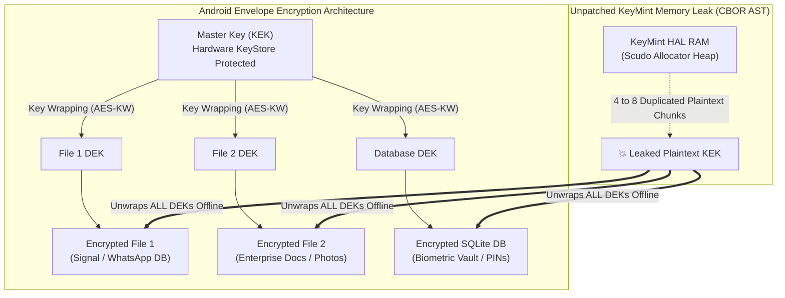

# Cryptographic Vulnerability Assessment: Persistent Master Key (KEK) Leakage via KeyMint CBOR AST Deserialization

**Document ID:** SEC-TR-2026-KEK-CBOR-02  
**Target Systems:** Android Platform Core Cryptography (KeyMint HAL, Keystore2, `RecoverableKeyStoreManager`, Envelope Encryption)  
**Target Platform Standards:** Common Criteria / NIAP MDF PP V3.3 (FCS_CKM_EXT.4 / FDP_DAR_EXT.2)  
**Classification:** Internal Technical Architecture & Threat Assessment  

---

## 1. Executive Overview

This report provides a detailed cryptographic evaluation of the **Key Encryption Key (KEK) / Persistent Master Key leakage vulnerability** occurring within unpatched KeyMint HAL implementations (prior to Patch 05).

Unlike ephemeral session key agreements (e.g. ISO 18013-5 mDL ECDH handshake), which only compromise a single in-flight data transmission, **the leakage of a symmetric Master Key (KEK) completely and permanently dismantles Android's envelope encryption and data-at-rest (DAR) confidentiality model**.



---

## 2. Technical Root Cause: The CBOR AST Deserialization Leak

### 2.1 What is CBOR in KeyMint HAL?
In the Android platform source code, KeyMint HAL utilizes **CBOR (Concise Binary Object Representation)** to serialize, deserialize, and transmit:
1. Imported symmetric and asymmetric key material.
2. Hardware-enforced authorization sets (`Tag::PURPOSE`, `Tag::KEY_SIZE`, `Tag::AUTH_TIMEOUT`, `Tag::UNLOCKED_DEVICE_REQUIRED`).
3. Encrypted key blobs and wrapping envelopes.

### 2.2 Mechanism of Key Multiplication & Fragmentation
When an application imports a Master Key (KEK) or performs Key Wrapping, the KeyMint Rust HAL parses the incoming CBOR byte stream into an in-memory **Abstract Syntax Tree (AST)** using standard deserialization crates:

```rust
// Internal KeyMint CBOR Parsing Flow (Unpatched State)
let parsed_ast: cbor::value::Value = cbor::de::from_reader(cbor_stream)?;
// The AST allocates multiple intermediate heap objects:
// 1. Root Map / Array container node
// 2. Tag key identifier node
// 3. ByteString node containing the raw 32-byte / 64-byte KEK payload
// 4. Temporary parsing buffers and deserialized KeyParameter structs
```

### 2.3 The Core Failure: Lack of Zeroization on Drop
* The standard Rust CBOR AST library does not implement the `Zeroize` trait on its `Drop` handlers.
* When parsing completes, the AST nodes are dropped, and their underlying heap memory is returned to the Linux memory allocator (Scudo) freelist **without executing `memset(0)`**.
* **Empirical Observation**: A single 32-byte AES-256 KEK operation leaves **4 to 8 distinct copies and sub-fragments scattered across multiple disconnected heap pages** in the KeyMint process address space.

---

## 3. Analysis of Exposure Timing: Is KEK Only Exposed During "Provisioning"?

A common engineering assumption is:  
> *"Because the Master Key (KEK) is generated or imported during initial app setup (provisioning), the window of vulnerability is limited to that single onboarding moment."*

**This assumption is technically flawed for three reasons:**

### 3.1 The Multi-Event KEK Lifecycle
KEK material is not merely touched during initial provisioning. In production systems, KEK cryptographic operations are executed across multiple recurring events:

| Lifecycle Event | Frequency | Trigger | CBOR AST Leak Occurs? |
| :--- | :--- | :--- | :--- |
| **1. Initial Provisioning** | One-time per container | App installation, work profile creation, wallet card enrollment | **YES (4-8 copies)** |
| **2. Key Wrapping / Unwrapping (Daily I/O)** | Recurring / On-Demand | File opening, background sync, database access under envelope encryption | **YES (Every unwrap operation)** |
| **3. Cloud Key Escrow Sync** | Periodic / Scheduled | Google Cloud Backup (`RecoverableKeyStoreManager` / `SecureBox`) | **YES (Re-encryption & export)** |
| **4. Keyset Rotation & Maintenance** | Periodic (e.g. 90 days) | Enterprise MDM security policy, Tink keyset rotation | **YES (New & Old KEK handled)** |
| **5. Device Unlock Sweep** | Every device unlock | Transitioning files from locked-state ECDH to symmetric KEK | **YES (Bulk re-wrap operation)** |

### 3.2 Permanent Validity of Compromised KEK
Even if a KEK were only processed during provisioning:
* A KEK is **persistent by design** (typically valid for months or years).
* Once the 32-byte KEK is extracted from memory **just once**, that stolen key remains valid indefinitely.
* The attacker does not need continuous memory access: they can take the KEK offline and permanently decrypt all historical and future files encrypted under that Master Key.

---

## 4. Attack Surface & Real-World Impact Scenarios

### Scenario 1: Bulk Offline Decryption of Application Data (Data-at-Rest)
1. **Target**: Encrypted SQLite databases and files belonging to messaging apps (Signal, WhatsApp), banking apps, enterprise containers, and password vaults.
2. **Attack Flow**:
   * The attacker copies the encrypted database files from the filesystem (e.g. via local backup, USB ADB backup, or physical extraction).
   * The attacker extracts the leaked KEK from KeyMint HAL memory.
   * On an offline workstation, the attacker unwraps all DEKs and decrypts 100% of the databases in bulk.
3. **Difference from Session Key (mDL) Attack**:
   * **No live radio/BLE sniffing required.**
   * **No timing constraints.**
   * **Every stored file on the device is compromised simultaneously.**

---

### Scenario 2: Permanent Bypass of Lock Screen Protection (FDP_DAR_EXT.2)
* Android KeyStore keys configured with `unlockedDeviceRequired=true` are designed to lock their cryptographic capabilities when the screen is locked, protecting files on stolen or lost devices.
* **The Failure**: If the KEK leaked into KeyMint user-space RAM while the device was unlocked, an attacker who acquires the device (or extracts its RAM) retains the KEK.
* **Result**: Even after the device is locked or powered off, the attacker possesses the raw symmetric key material and can decrypt all data offline, completely invalidating the hardware lock screen guarantee.

---

### Scenario 3: Cloud Key Escrow & Backup Hijacking (`RecoverableKeyStoreManager`)
* Android's cloud backup framework uses `RecoverableKeyStoreManager` to back up application master keys to Google Cloud, encrypted via `SecureBox` (ECDH + AES-GCM).
* If the KEK (or intermediate `SecureBox` shared secret) leaks during the cloud backup routine:
  * An attacker intercepting the cloud backup bundle can restore and decrypt all application keys without needing the citizen's device lockscreen PIN/pattern.
  * The attacker can forge recovery responses, potentially poisoning or destroying cloud backup snapshots.

---

## 5. Comparative Severity Matrix: KEK Leak vs. Ephemeral Session Leak

| Evaluation Dimension | Ephemeral Session Leak (mDL / ISO 18013-5) | Master Key (KEK) Leak (CBOR AST / Envelope Encryption) |
| :--- | :--- | :--- |
| **Cryptographic Scope** | Single presentation session | **All past, present, and future files under the Master Key** |
| **Data Scope** | In-transit citizen attributes presented to reader | **Entire device storage (databases, photos, enterprise docs)** |
| **Prerequisites** | Live BLE radio capture + KeyMint RAM read | **Static file copy + One-time KeyMint RAM read** |
| **Attack Location** | Physical proximity during active transaction | **Completely offline on attacker's workstation** |
| **Memory Residue Count** | 1 instance (`libbinder_rs` return vector) | **4 to 8 scattered instances (CBOR AST tree fragmentation)** |
| **Defense-in-Depth Impact** | Compromises transit channel confidentiality | **Complete collapse of Platform Data-at-Rest Security** |

---

## 6. Required Platform Remediation

To eliminate KEK leakage across the Android platform, two architectural remedies are mandatory:

1. **KeyMint Patch 05 (HAL Internal CBOR Zeroization)**:
   * Implement recursive zeroizing visitors on all CBOR AST nodes (`cbor::value::Value`) ensuring that every intermediate heap allocation is scrubbed upon `Drop`.
2. **Binder IPC Layer Zeroization (`libbinder_rs`)**:
   * Wrap returned sensitive vectors (`_aidl_return`) in zeroizing containers (`zeroize::Zeroizing<Vec<u8>>`) to prevent the final delivered key from lingering on Scudo's freelist.
3. **Application & Framework Hygiene**:
   * Enforce immediate zeroization (`Arrays.fill(keyBytes, 0)`) in JCA callers (`RawHybridKeyProvider`, `CredstoreIdentityCredential`, `SecureBox`).
